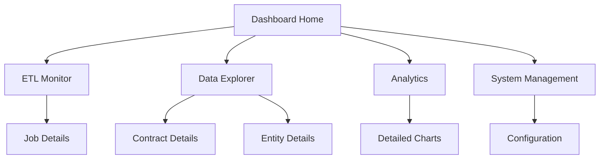

## 1. Product Overview
Contrap Dashboard is a Next.js web application built with React and shadcn/ui components that provides real-time monitoring and management capabilities for the Portuguese Government Contracts ETL system. It enables users to monitor ETL job status, visualize procurement data, and manage system operations through an intuitive web interface.

## 2. Core Features

### 2.1 User Roles
| Role | Registration Method | Core Permissions |
|------|---------------------|------------------|
| Default User | Direct access (no authentication required for MVP) | Can view dashboards, monitor ETL status, browse contract data |

### 2.2 Feature Module
Our dashboard requirements consist of the following main pages:
1. **Dashboard Home**: ETL status overview, system health metrics, recent activity summary
2. **ETL Monitor**: Real-time job monitoring, execution logs, performance metrics
3. **Data Explorer**: Contract and announcement browsing, search and filtering capabilities
4. **Analytics**: Data visualization charts, spending trends, entity statistics
5. **System Management**: ETL job controls, configuration settings, database status

### 2.3 Page Details
| Page Name | Module Name | Feature description |
|-----------|-------------|---------------------|
| Dashboard Home | Status Overview | Display current ETL job status, last successful run timestamp, system health indicators |
| Dashboard Home | Quick Stats | Show total contracts processed, entities discovered, data volume metrics |
| Dashboard Home | Recent Activity | List recent ETL runs with status, duration, and record counts |
| ETL Monitor | Job Status | Real-time display of running/scheduled ETL jobs with progress indicators |
| ETL Monitor | Execution Logs | Stream live logs from ETL processes with filtering and search capabilities |
| ETL Monitor | Performance Metrics | Charts showing processing times, throughput, error rates over time |
| ETL Monitor | Manual Controls | Start/stop ETL jobs, trigger immediate runs, reset processing state |
| Data Explorer | Contract Browser | Paginated table of contracts with sorting, filtering by date, entity, amount |
| Data Explorer | Entity Directory | Browse government entities and competitors with details and statistics |
| Data Explorer | Search Interface | Global search across contracts, announcements, and entities |
| Analytics | Spending Trends | Line charts showing government spending over time by category |
| Analytics | Entity Analysis | Bar charts of top entities by contract volume and value |
| Analytics | CPV Distribution | Pie charts showing procurement categories distribution |
| System Management | ETL Configuration | View and modify ETL settings, scheduling, API endpoints |
| System Management | Database Status | Connection status, table sizes, index health, query performance |
| System Management | Data Quality | Reports on data validation issues, duplicate detection, error summaries |

## 3. Core Process
The main user flow involves monitoring ETL operations and exploring processed data. Users start at the Dashboard Home to get an overview of system status, then navigate to ETL Monitor for detailed job tracking, Data Explorer for browsing contracts and entities, Analytics for insights visualization, and System Management for operational controls.



## 4. User Interface Design
### 4.1 Design Style
- **UI Framework**: shadcn/ui components for consistent design system
- **Primary colors**: Blue (#2563eb) and Green (#059669) for status indicators
- **Secondary colors**: Gray (#6b7280) for text, Red (#dc2626) for errors
- **Button style**: shadcn/ui Button components with variants (default, destructive, outline, secondary)
- **Font**: Inter or system fonts, 14px base size
- **Layout style**: Clean dashboard with shadcn/ui Card components and top navigation
- **Icons**: Lucide React icons (integrated with shadcn/ui)

### 4.2 Page Design Overview
| Page Name | Module Name | UI Elements |
|-----------|-------------|-------------|
| Dashboard Home | Status Overview | Status cards with colored indicators, progress bars, timestamp displays |
| Dashboard Home | Quick Stats | Metric cards with large numbers, trend indicators, sparkline charts |
| ETL Monitor | Job Status | Real-time status badges, progress bars, action buttons for job control |
| ETL Monitor | Execution Logs | Terminal-style log viewer with syntax highlighting and auto-scroll |
| Data Explorer | Contract Browser | Data table with pagination, sort headers, filter dropdowns, search input |
| Analytics | Charts | Responsive charts using Chart.js or Recharts with interactive tooltips |
| System Management | Configuration | Form inputs with validation, toggle switches, save/reset buttons |

### 4.3 Responsiveness
Desktop-first design with mobile-adaptive layout. Touch interaction optimization for mobile devices with larger buttons and swipe gestures for table navigation.

## 5. API Integration

### 5.1 Portuguese Government Procurement API Configuration
- **Base Endpoint**: `https://www.base.gov.pt/APIBase2`
- **Personal Access Token**: `Nmq28lKgTbr05RaFOJNf`
- **WADL Documentation**: `https://www.base.gov.pt/APIBase2/api.wadl`
- **Authentication**: All requests require the token in the Authorization header as `_AcessToken: <Token>`

### 5.2 Available API Endpoints
- **Get Contract Information**: `GET /GetInfoContrato?idContrato=<contract_id>`
  - Parameters: idContrato, IdProcedimento, nifEntidade, nAnuncio, Ano (at least one mandatory)
- **Get Announcement Information**: `GET /GetInfoAnuncio?nAnuncio=<Announcement_Number>`
  - Parameters: nAnuncio, nifEntidade, IdIncm, Ano (at least one mandatory)
- **Get Contract Modification Information**: `GET /GetInfoModContrat?idContrato=<contract_id>`
  - Parameters: idContrato, Ano (at least one mandatory)
- **Get Entity Information**: `GET /GetInfoEntidades?nifEntidade=<nifEntidade>`
  - Parameters: nifEntidade (mandatory)

### 5.3 API Response Codes
- **200 OK**: Successful request
- **Error no Params submited**: Missing or invalid parameters
- **The Token is required**: Missing authentication token
- **Invalid Token**: Invalid authentication token
- **500 Internal Server Error**: Server-side error

### 5.4 API Usage Examples

**Get Entity Information by NIF:**
```bash
curl -i -X GET "https://www.base.gov.pt/APIBase2/GetInfoEntidades?nifEntidade=512021155" \
  -H "_AcessToken: Nmq28lKgTbr05RaFOJNf"
```

**Get Contract Information by Contract ID:**
```bash
curl -i -X GET "https://www.base.gov.pt/APIBase2/GetInfoContrato?idContrato=11623631" \
  -H "_AcessToken: Nmq28lKgTbr05RaFOJNf"
```

**Get Announcements by Year:**
```bash
curl -i -X GET "https://www.base.gov.pt/APIBase2/GetInfoAnuncio?Ano=2025" \
  -H "_AcessToken: Nmq28lKgTbr05RaFOJNf"
```

**Get Contracts by Year:**
```bash
curl -i -X GET "https://www.base.gov.pt/APIBase2/GetInfoContrato?Ano=2025" \
  -H "_AcessToken: Nmq28lKgTbr05RaFOJNf"
```

## 6. Technical Architecture

### 6.1 Frontend Technology Stack
- **Framework**: Next.js 14+ with App Router
- **UI Library**: React 18+
- **Component Library**: shadcn/ui for consistent design system
- **Styling**: Tailwind CSS (integrated with shadcn/ui)
- **State Management**: React Query for server state, Zustand for client state
- **Charts**: Recharts for data visualization
- **Icons**: Lucide React
- **TypeScript**: Full TypeScript support

### 6.2 Backend Technology Stack
- **Language**: Go (Golang) for high-performance ETL processing
- **Database**: PostgreSQL with JSONB support for flexible data storage
- **ORM**: GORM (Go Object-Relational Mapping) for database operations and migrations
- **API Framework**: Gin or Fiber for REST API development
- **WebSocket**: Gorilla WebSocket for real-time monitoring
- **Authentication**: JWT tokens for secure API access
- **Database Driver**: PostgreSQL driver with GORM integration

### 6.3 Backend Integration
- **API Communication**: REST API calls to Go backend
- **Real-time Updates**: WebSocket connection for live ETL monitoring
- **Authentication**: Token-based authentication for API access
- **Data Fetching**: React Query for caching and synchronization

## 7. Implementation Plan

### Phase 1: Infrastructure Foundation (Weeks 1-3)
**Priority**: Critical - Must be completed before any other phases

#### 7.1.1 Docker Environment Setup
- Create Docker containers for PostgreSQL database
- Set up Docker Compose configuration for multi-service orchestration
- Configure environment variables and secrets management
- Establish development and production Docker environments

#### 7.1.2 Database Infrastructure
- Deploy PostgreSQL database with proper schema
- Implement the 10-table normalized database structure
- Set up database migrations and version control
- Configure database connection pooling and performance optimization
- Create database backup and recovery procedures

#### 7.1.3 ETL Core System
- Develop Go-based ETL extraction modules for Portuguese Government API
- Implement data transformation logic for contract and entity processing
- Create data loading mechanisms with conflict resolution using GORM ORM
- Build incremental processing capabilities with GORM database operations
- Implement error handling and retry mechanisms
- Set up GORM models and database migrations for all entities

### Phase 2: Job Processing & CLI (Weeks 4-5)
**Dependencies**: Phase 1 must be completed

#### 7.2.1 Job Processor Development
- Create job queue system for ETL task management
- Implement job scheduling and execution engine
- Build job status tracking and logging
- Create job retry and failure handling mechanisms
- Develop job performance monitoring

#### 7.2.2 CLI Interface
- Build command-line interface for manual ETL triggering
- Implement CLI commands for job management (start, stop, status, logs)
- Create CLI configuration management
- Add CLI help documentation and usage examples
- Implement CLI authentication and security

### Phase 3: API Backend (Weeks 6-7)
**Dependencies**: Phases 1-2 must be completed

#### 7.3.1 REST API Development
- Create Go-based REST API server
- Implement endpoints for dashboard data retrieval
- Build real-time WebSocket connections for live monitoring
- Create API authentication and authorization
- Implement API rate limiting and security measures

#### 7.3.2 API Documentation
- Generate OpenAPI/Swagger documentation
- Create API usage examples and integration guides
- Implement API versioning strategy
- Build API testing and validation tools

### Phase 4: Next.js Web Dashboard (Weeks 8-12)
**Dependencies**: All previous phases must be completed
**Note**: This is the final phase focusing on the web application

#### 7.4.1 Next.js Project Setup
- Initialize Next.js 14+ project with App Router
- Configure shadcn/ui component library
- Set up Tailwind CSS and design system
- Implement TypeScript configuration
- Configure development and build environments

#### 7.4.2 Core Dashboard Pages
- **Week 8**: Dashboard Home with status overview and quick stats
- **Week 9**: ETL Monitor with real-time job tracking and logs
- **Week 10**: Data Explorer for contract and entity browsing
- **Week 11**: Analytics with charts and data visualization
- **Week 12**: System Management for configuration and controls

#### 7.4.3 Advanced Features
- Implement real-time updates via WebSocket integration
- Build responsive design for mobile and tablet devices
- Create data export and reporting capabilities
- Implement advanced search and filtering
- Add user preferences and dashboard customization

### Phase 5: Testing & Deployment (Weeks 13-14)
**Dependencies**: All development phases completed

#### 7.5.1 Testing & Quality Assurance
- Unit testing for ETL components and API endpoints
- Integration testing for full system workflow
- Frontend testing with React Testing Library
- Performance testing and optimization
- Security testing and vulnerability assessment

#### 7.5.2 Production Deployment
- Production Docker environment setup
- CI/CD pipeline configuration
- Monitoring and alerting system setup
- Documentation and user guides
- Production data migration and validation

### Implementation Notes
- **Infrastructure First**: The web dashboard cannot function without the underlying ETL system, database, and API backend
- **Incremental Development**: Each phase builds upon the previous, ensuring a solid foundation
- **Testing Integration**: Testing should be integrated throughout each phase, not just at the end
- **Documentation**: Maintain comprehensive documentation throughout all phases for future maintenance and scaling